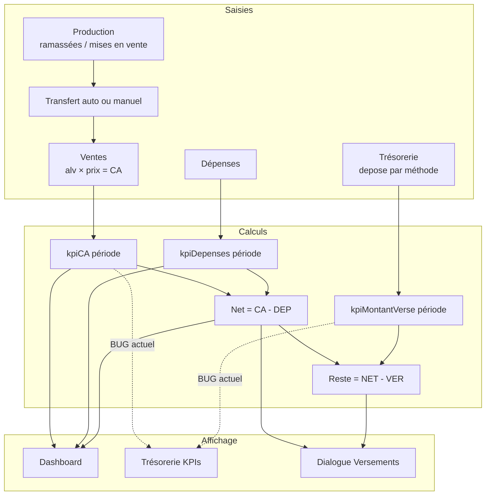

# Audit formules, parcours chiffres & dialogues — LanaFarm

> **Objectif** : document unique pour corriger les incohérences KPI / trésorerie / dialogues.  
> **Référence test** : jeu simple 25–26 mai 2026, calendrier **25 → 31 mai 2026**, prix **10 000 GNF/alvéole**.  
> **Date audit** : 2026-05-26.

---

## 1. Règle métier cible (à faire respecter partout)

### 1.1 Définitions

| Terme | Formule canonique | Filtre |
|-------|-------------------|--------|
| **CA** | Σ (alv. vendues × prix casier) lignes vente `actif` | **Période calendrier** |
| **Dépenses** | Σ `montant` dépenses `actif` | **Période calendrier** |
| **Net à remettre** | `CA − Dépenses` | **Période calendrier** |
| **Déjà versé** | Σ `depose` trésorerie `actif` | **Période calendrier** |
| **Reste à verser** | `max(0, Net à remettre − Déjà versé)` | **Période calendrier** |
| **Sur-versement** | si `Déjà versé + saisie > Net` → alerte / blocage | — |

### 1.2 Ce que « Total reçu » ne doit PAS être

Aujourd’hui **Total reçu** (carte Trésorerie) = Σ `montantRecu` des lignes trésorerie.  
En saisie rapide `addDay`, le code force **`montantRecu = depose`** → **Total reçu = Montant versé** (doublon inutile).

**Recommandation** :
- soit renommer en « Versements enregistrés » ;
- soit **Total reçu = CA période** (encaissements théoriques) et garder « Montant versé » séparé.

### 1.3 Source unique obligatoire

Créer **`kpiNetARemettre`** et **`kpiResteAVerserPeriode`** dans `src/lib/kpi-sources.ts` :

```ts
// Cible
kpiNetARemettre(ventes, depenses, from, to, cap)
  => kpiCA(...) - kpiDepenses(...)

kpiResteAVerserPeriode(ventes, depenses, tresorerie, from, to, cap)
  => max(0, kpiNetARemettre(...) - kpiMontantVerse(tresorerieFiltree))
```

**Supprimer** l’usage de l’ancien `kpiResteAVerser` (CA global − versé global, **sans dépenses**) pour l’UI période.

---

## 2. Jeu de test minimal (référence)

### 2.1 Saisies

| Module | Date | Valeur |
|--------|------|--------|
| Production | 25/05 | 20 alv. ramassées, 20 mises en vente |
| Production | 26/05 | 10 alv. ramassées, 10 mises en vente |
| Vente | 25/05 | 10 alv. × 10 000 GNF |
| Vente | 26/05 | 5 alv. × 10 000 GNF |
| Dépense | 25/05 | 30 000 GNF |
| Dépense | 26/05 | 10 000 GNF |
| Trésorerie | 25/05 | Orange Money, **50 000** GNF versés |

### 2.2 Attendu (période 25–31 mai)

| Indicateur | Calcul | **Attendu** |
|------------|--------|-------------|
| CA | 100k + 50k | **150 000** |
| Dépenses | 30k + 10k | **40 000** |
| Net à remettre | 150k − 40k | **110 000** |
| Déjà versé | | **50 000** |
| **Reste à verser** | 110k − 50k | **60 000** |
| Profit | idem net | **110 000** |
| Stock magasin (cumul) | transferts − ventes | **15 alv.** (si prod = transferts) |

---

## 3. Écart constaté sur captures (bugs confirmés)

### Capture A — Dialogue tréso, jour **29/05**, avant versement

| Zone | Affiché | Attendu | Verdict |
|------|---------|---------|---------|
| Résumé semaine (badge) | 110 000 | **110 000** (reste = net − 0 versé) | OK si aucun versement encore |
| Reste semaine (preview) | 110 000 | 110 000 | OK |
| Bouton Enregistrer | actif avec montant 0 ? | **désactivé** si pas de ligne valide | À vérifier (validation lignes) |

### Capture B — Page Trésorerie, **avant** saisie tréso

| KPI | Affiché | Attendu | Verdict |
|-----|---------|---------|---------|
| Total reçu | 0 | 0 ou CA 150k selon définition | Ambigu |
| Montant versé | 0 | 0 | OK |
| **Reste à verser** | **150 000** | **110 000** (ou 60k après versement) | **BUG** : `kpiResteAVerser` = CA − versé, **sans dépenses** |

### Capture C — Dashboard, même état

| KPI | Affiché | Attendu | Verdict |
|-----|---------|---------|---------|
| CA | 150 000 | 150 000 | OK |
| Dépenses | 40 000 | 40 000 | OK |
| Profit | 110 000 | 110 000 | OK |
| Montant versé | 0 | 0 | OK |
| **Reste à verser** | **150 000** | **110 000** | **BUG** (même formule que B) |

### Capture D — Page Trésorerie, **après** 50k le 25/05

| KPI | Affiché | Attendu | Verdict |
|-----|---------|---------|---------|
| Total reçu | 50 000 | 50 000 (lignes tréso) | OK comme « versements » |
| Montant versé | 50 000 | 50 000 | OK |
| **Reste à verser** | **100 000** | **60 000** | **BUG** : 150k − 50k, dépenses ignorées |
| Dialogue (si rouvert) | Résumé devrait montrer **60 000** | 110k − 50k | Dialogue **OK** si `dejaVerse` filtre la période ; KPI page **faux** |

**Conclusion** : le **dialogue** utilise la bonne formule (`CA − dépenses − déjà versé`). Les **cartes KPI** (page Trésorerie + Dashboard) utilisent une **autre formule** → l’utilisateur voit des chiffres contradictoires.

---

## 4. Parcours chiffres (flux bout en bout)



### 4.1 Fichiers par maillon

| Maillon | Fichier | Fonction / zone |
|---------|---------|----------------|
| CA | `lib/lanafarm-core.ts` | `calculerCA` |
| Dépenses | `lib/kpi-sources.ts` | `kpiDepenses` |
| Profit | `lib/kpi-sources.ts` | `kpiProfit` |
| Versements période | `lib/kpi-sources.ts` | `kpiMontantVerse` + `useTresorerieInRange` |
| **Reste (cassé)** | `lib/kpi-sources.ts` | `kpiResteAVerser` ← **à remplacer** |
| Dialogue reste | `components/tresorerie/add-tresorerie-dialog.tsx` | `weekFinance` (inline, correct) |
| Dashboard reste | `lib/dashboard-calc.ts` | `montantEnAttente: kpiResteAVerser(...)` ← **commentaire faux** (« période » mais données globales) |
| Store tréso | `contexts/farm-store.tsx` | `tresorerie/addDay` : `depose = montantRecu`, pas de plafond |

---

## 5. Audit dialogues (conditions Enregistrer)

### 5.1 Trésorerie — `add-tresorerie-dialog.tsx`

| Condition | Existe ? | Fichier |
|-----------|----------|---------|
| Date ≤ aujourd’hui | Oui | `DateInput max` |
| Méthode + montant > 0 | Oui | `validateTresorerieDayDraft` |
| **Montant ≤ reste période** | **Non** | — |
| **Net > 0 pour autoriser versement** | **Non** | — |
| Multi-jours + conflit | Oui | `MultiDayConflictDialog` |
| Preview = `resteApres` | Oui | `weekFinance.resteApres` |
| Résumé badge = `reste` (pas net seul) | Oui | `WeekContextPanel` |

**Bug UX** : on peut enregistrer un versement alors que **reste = 0** ou **saisie > reste** → fausse les agrégats sans alerter.

### 5.2 Ventes — `add-sale-dialog.tsx`

| Condition | Existe ? |
|-----------|----------|
| Stock magasin | Oui UI + store |
| Prix > 0, alvéoles | Oui |
| Multi-jours conflit | Oui |

### 5.3 Dépenses — `add-expense-dialog.tsx`

| Condition | Existe ? |
|-----------|----------|
| Catégorie + montant | Oui UI + store |
| Lien trésorerie | Non (normal) |

### 5.4 Production — `add-production-dialog.tsx`

| Condition | Existe ? |
|-----------|----------|
| Mises ≤ ramassées | Oui UI |
| 1 jour / conflit multi | Oui |
| Stock ferme réel (store) | **Non** |

### 5.5 Transfert manuel — `send-stock-dialog.tsx`

| Condition | Existe ? |
|-----------|----------|
| ≤ stock ferme | Oui UI + store |

---

## 6. Audit KPI par écran

| Écran | KPI | Formule actuelle | Formule cible | OK ? |
|-------|-----|------------------|---------------|------|
| Dashboard | CA | `kpiCA` période | idem | Oui |
| Dashboard | Dépenses | `kpiDepenses` période | idem | Oui |
| Dashboard | Profit | `kpiProfit` période | idem | Oui |
| Dashboard | Montant versé | `kpiMontantVerse(tresorerieInRange)` | idem | Oui |
| Dashboard | Reste à verser | `kpiResteAVerser(allVentes, allTreso)` | **`kpiResteAVerserPeriode`** | **Non** |
| Trésorerie | Total reçu | Σ `montantRecu` tréso période | Clarifier vs CA | Ambigu |
| Trésorerie | Montant versé | Σ `depose` période | idem | Oui |
| Trésorerie | Reste à verser | `kpiResteAVerser` **global** | **période + dépenses** | **Non** |
| Dialogue tréso | Net / reste | CA − dep − versé **période** | idem | Oui |
| Notifications | Reste élevé | `kpiResteAVerser` global | aligner sur période 7j ou global explicite | Non |

---

## 7. Incohérences de libellés

| Libellé UI | Comportement réel | Action |
|------------|-------------------|--------|
| « Total reçu » | Somme `montantRecu` trésorerie (= versé en saisie rapide) | Renommer ou lier au CA |
| « Reste à verser » (carte) | CA cumul − versé cumul | Aligner sur dialogue |
| « Reste semaine » (dialogue) | Reste **période** après saisie | OK, garder |
| `montantEnAttente` (dashboard-calc) | Commentaire dit « période », code = global | Corriger code + commentaire |

---

## 8. Plan de correction (priorité)

### P0 — Bloquant chiffres faux

1. **`kpiResteAVerserPeriode`** dans `kpi-sources.ts` (CA − dépenses − versé, filtre période).
2. Remplacer dans `tresorerie-kpis.tsx`, `dashboard-calc.ts`, `notification-rules.ts`.
3. Déprécier ou documenter `kpiResteAVerser` (cumul vie entière) si encore utile ailleurs.

### P1 — Dialogue & store

4. `canSubmit` tréso : `draftVersePending > 0` **et** `draftVersePending <= weekFinance.reste` (ou `resteApres >= 0`).
5. `tresorerie/addDay` : refuser si total jour dépasse reste jour (optionnel) ou reste période.
6. Message d’erreur explicite : « Versement supérieur au reste (60 000 GNF). »

### P2 — Clarté

7. Renommer « Total reçu » ou afficher CA période à côté.
8. Tests unitaires sur le jeu §2.2 (150k / 40k / 110k / 50k / **60k**).

---

## 9. Checklist validation manuelle (après correctifs)

- [ ] Calendrier 25–31 mai, données §2.1 saisies.
- [ ] Dashboard : Reste à verser = **60 000** (pas 100k ni 150k).
- [ ] Page Trésorerie : idem **60 000**.
- [ ] Dialogue 29/05 : Résumé **60 000**, preview « Reste semaine » **60 000** (si 50k déjà versés).
- [ ] Tentative versement **70 000** : bouton désactivé ou erreur.
- [ ] Tentative versement **0** : bouton désactivé.
- [ ] Profit reste **110 000**, CA **150 000**, Dépenses **40 000**.

---

## 10. Fichiers à modifier (pour Claude)

| Fichier | Action |
|---------|--------|
| `src/lib/kpi-sources.ts` | Ajouter `kpiNetARemettre`, `kpiResteAVerserPeriode` |
| `src/components/tresorerie/tresorerie-kpis.tsx` | Utiliser reste période + filtre ventes/dépenses période |
| `src/lib/dashboard-calc.ts` | `montantEnAttente` → nouvelle fonction |
| `src/lib/notifications/notification-rules.ts` | Aligner seuil reste |
| `src/components/tresorerie/add-tresorerie-dialog.tsx` | Garde-fou `canSubmit` |
| `src/contexts/farm-store.tsx` | Validation optionnelle `tresorerie/addDay` |
| `docs/DONNEES_TEST_CHECKLIST.md` | Ajouter jeu §2 + attendus 60k |

---

*Ce document est la référence unique pour la prochaine passe de correction formules / KPI / dialogues.*
